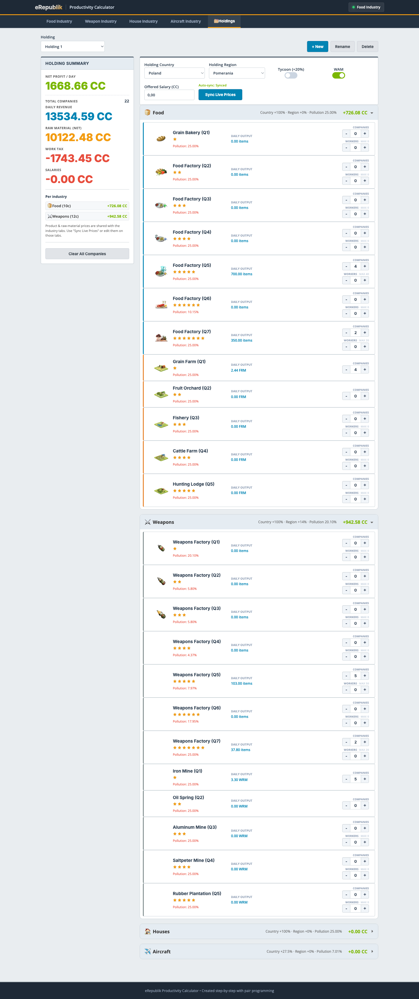
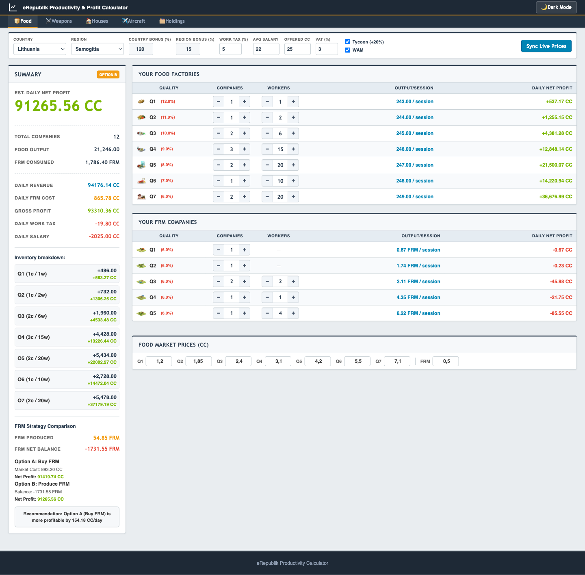
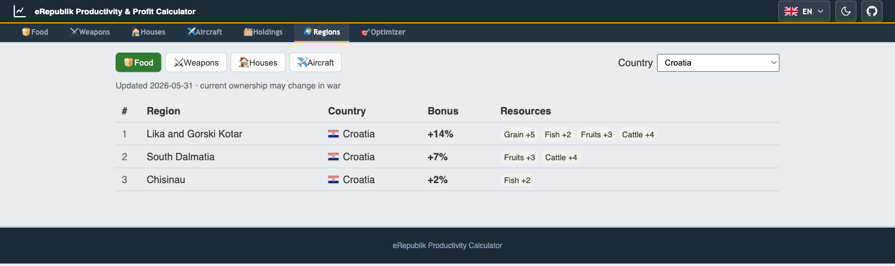
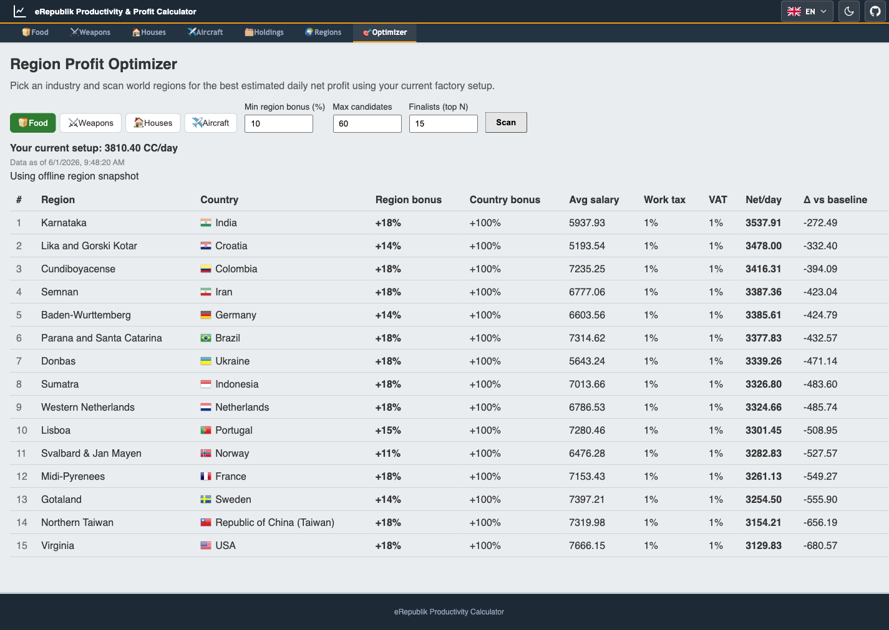

# eRepublik Productivity & Profit Calculator

[](https://epc.yurii.live)

🌐 **Try it live: [epc.yurii.live](https://epc.yurii.live)**

A single-page web app that estimates **daily profit** for your
[eRepublik](https://www.erepublik.com) companies across all four industries —
food, weapons, houses, and aircraft weapons — and helps you find the most
profitable **region** to relocate to. Built with **Vite + React 19 +
TypeScript**. All calculations run client-side; the bundled Node server serves
the production build and proxies game requests around CORS.

## Features

- **Four industry modules** — Food, Weapons, Houses, and Aircraft Weapons, each
  with Q1–Q7 (or Q1–Q5) factories and their raw-material companies
  (plantations / mines / RM refineries).
- **Holdings mode** 🗂️ — model a *holding company*: one location containing a
  **mix of companies across all industries**, with combined per-holding profit.
  Each industry's productivity uses that region's **industry-specific** bonuses
  (country bonus per token, region resource bonus, per-quality pollution).
  Create, rename, switch, and clear holdings.
- **Game-accurate math** — mirrors eRepublik's own rounding (raw production
  truncated to 2 decimals, per-company values summed), Work-as-Manager sessions,
  per-industry VAT, work tax, and offered-salary labor cost.
- **Buy-vs-produce strategy** (industry tabs) — compares buying raw material on
  the market against running your own RM companies and recommends the cheaper
  path.
- **Regions browser** 🗺️ — rank every region by its **production bonus** for a
  chosen industry (the sum of that industry's resource bonuses in the region),
  optionally scoped to a single country, to see at a glance where production is
  strongest.
- **Region Optimizer** 🚀 — scans the **whole region universe** to find the most
  profitable place to relocate your current setup. It filters regions by bonus,
  ranks them by real net profit using each owner country's live economics (bonus,
  average salary, work tax, VAT), then refines the top finalists with their
  **actual pollution** and re-ranks. Region ownership is pulled live (so it tracks
  war), while the resource-bonus map comes from a dated snapshot.
- **Live data sync** — pulls current market prices from
  `service.erepublik.tools` and scrapes country/region productivity bonuses,
  pollution, work tax, and VAT from `erepublik.com` (via the local proxy). The
  optimizer additionally uses a server-cached `/api/universe` region feed so live
  ownership is fetched once per 30 minutes, not per visitor.
- **Localized** 🌍 — available in 25 languages.
- **Persistent** — all input is saved to `localStorage`.

## Screenshots

**Holdings mode** — a single holding in one region with a mix of Food and Weapon
companies; each industry uses that region's own bonuses, and the left summary
shows the combined daily profit with a per-industry breakdown.



**Industry view** — the Food module with factories, plantations, the live
buy-vs-produce strategy comparison, and location/market modifiers.



**Regions browser** — every region that produces a given industry's resources,
ranked by total production bonus, with the contributing resource chips. Filter
by country (here, Croatia) or browse the whole world.



**Region Optimizer** — scan world regions for the best estimated **daily net
profit** for your current factory setup. Each finalist shows its region/country
bonuses, the owner country's live economics (avg salary, work tax, VAT), the
projected net per day, and the delta versus your current location.



## Run

Requires [Node.js](https://nodejs.org) (v18+).

```bash
npm install
npm run dev      # Vite dev server (HMR) on http://localhost:5173
npm run build    # type-check + build to dist/
npm run serve    # node server.js — serves dist/ + /proxy + /api/universe on :8080
```

For development, just run `npm run dev` — it auto-spawns `server.js` on `:8080`
(for `/proxy` and `/api/universe`) and tears it down on exit, reusing an already
running server if one is present. For production, `npm run build` then `npm run
serve` (or `node server.js`) serves the built app from `dist/` at
<http://localhost:8080>. Live data fetches go through the server's `/proxy`
endpoint to bypass CORS, and the region universe through `/api/universe`.

## Tests

```bash
npm test         # Vitest — calc golden-parity, state, components, views
```

The profit math is covered by a golden-parity suite that asserts the React
calc layer is bit-identical to the original `holdingsCalc.mjs`.

## Architecture

A single React tree under `src/`, with a strict separation between **pure profit
math** (no DOM, no React) and the UI that renders it.

| Path | Responsibility |
|------|----------------|
| `src/calc/` | **Pure profit math** — rounding, productivity multiplier, per-industry & summed profit, plus the optimizer ranking (`optimizer.ts`, `regionBonus.ts`, `regionJoin.ts`). Golden-parity locked (`calc/golden.test.ts`). |
| `src/regions/` | Pure region ranking for the Regions browser (`ranking.ts`). |
| `src/state/` | One immutable reducer + Context, reached only via facade hooks (`state/hooks.ts`); `localStorage` load/migrate/save; live country→region dropdown list (`useRegionList.ts`). |
| `src/data/` | Static, typed game facts (factory/plantation/RM configs, building icon ids) + the dated region resource-bonus seed (`regionResources.ts`). |
| `src/services/` | Live data via `/proxy` and `/api/universe` — pure parsers + thin fetchers for market prices, country/region modifiers, the region universe, and per-country economics (with a bounded concurrency pool). |
| `src/i18n/` | Synchronous `react-i18next` setup with bundled JSON catalogs for 25 locales. |
| `src/components/` | Shared UI (Counter, IconImage, StarRating, TabBar, LanguageSwitcher, Flag). |
| `src/views/` | `IndustryView/` (one industry tab), `HoldingsView/` (holdings mode), `RegionsView/` (region browser), `OptimizerView/` (universe scan). |
| `server.js` | ESM `http` server: serves `dist/`, an allowlisted `/proxy` GET endpoint, and a server-cached `/api/universe` region feed. |
| `styles/` | Per-concern stylesheets, composed via `styles/index.css`. |

Profit math is DOM-free and must stay golden-parity green; components reach state
only through the `src/state/hooks.ts` facades, never raw dispatch. Design notes
and per-feature specs/plans live under `docs/superpowers/`.

## Acknowledgements

Live market prices come from the excellent **[eRepublik Tools](https://erepublik.tools)**
API (`service.erepublik.tools`). Huge thanks to its authors for their work and
for keeping it available — without it, up-to-date prices simply wouldn't be
reachable and users would have to look up and enter every Q1–Q7 price by hand.
Please support and respect their service; use it responsibly.

## Disclaimer

This is an unofficial fan-made tool and is not affiliated with or endorsed by
eRepublik Labs. Game mechanics and markup change over time; the live scrapers
fall back to manual input when the game's HTML changes.

## License

[MIT](LICENSE) © Yurii Chekhotskyi
